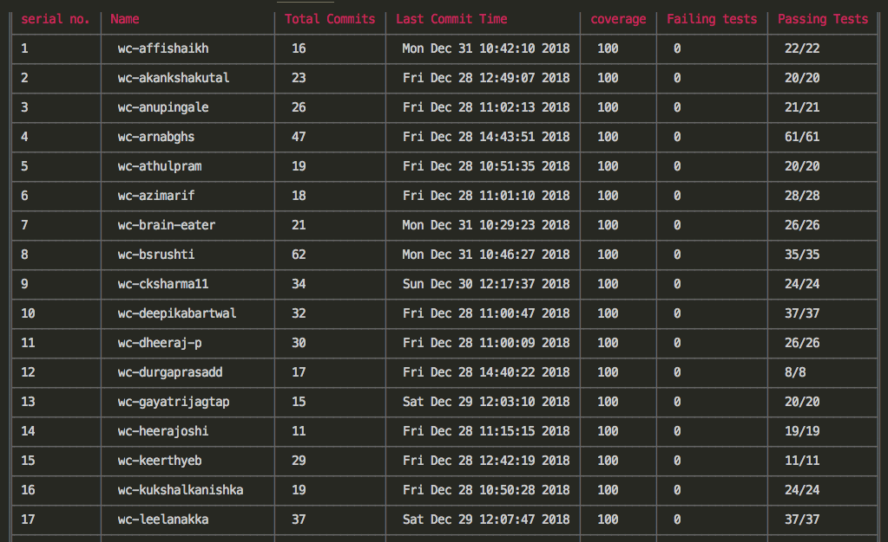

# Thanos
>thanoScript.js file generates the report of wc and head assignment tests and coverage results.
>To see the generated result by thanoScript.js, you need to execute format.js file using node.

